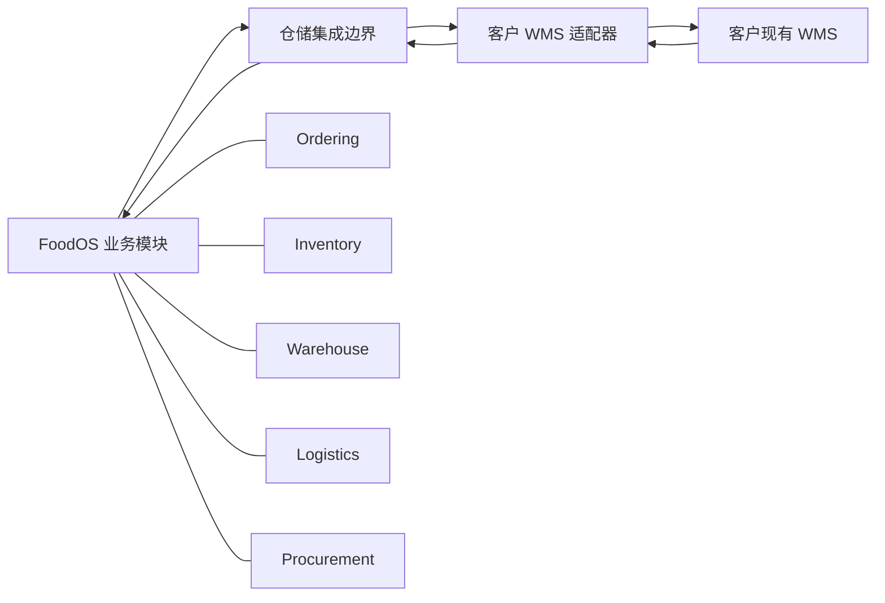
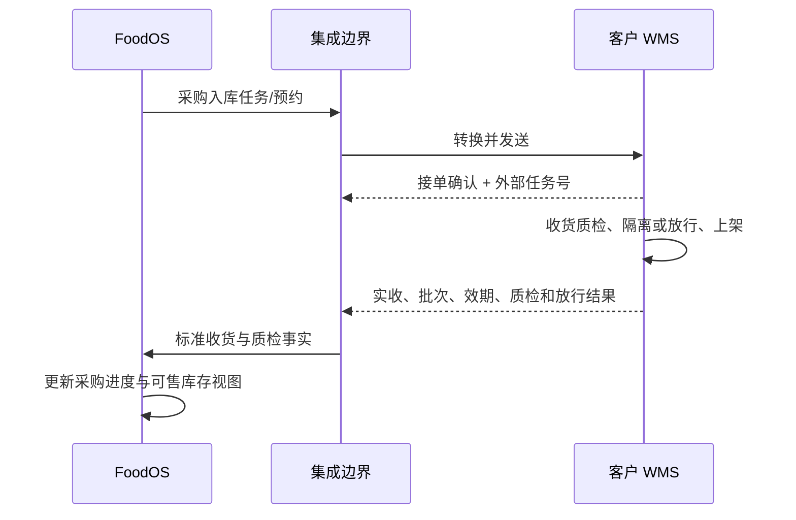
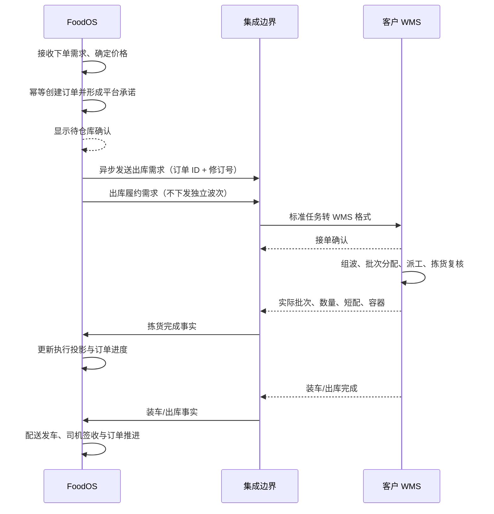

# FoodOS 与客户现有 WMS 对接：技术方案

> 文档用途：双方技术评审的方案基线。
>
> 状态：2026-09-24 FoodOS 已按用户决定制定 `FoodOS WMS Standard v1` 并开始实现，不再等待仓库方先给协议。仓库方适配依据为 [OpenAPI 契约](contracts/foodos-wms-v1.openapi.yaml) 和 [接入指南](contracts/FoodOS-WMS-Standard-v1-接入指南.md)。业务责任仍以 [已确认决策](FoodOS-客户WMS对接-核心问题决策建议.md) 为准；开发环境验证不代表生产切换授权。

### 1.0 标准版本与兼容规则

- 当前协议版本为 `1.0.0`，事件信封 `schemaVersion` 固定为 `1.0`。
- 5.4b 对外发放前的本次补全属于 v1 初始契约定稿，尚无仓库方消费者；后续按以下兼容规则演进。
- 仓库方一期最小实现健康、销售出库任务及取消接口，并回传出库进度、短配和库存事实；预占、释放、结果查询为可选增强能力。FoodOS 实现带签名的事件接收接口。
- 双方使用至少 32 字节随机密钥和 HMAC-SHA256 校验原始请求体，默认重放窗口为正负 300 秒；测试、开发和生产密钥必须隔离。
- HTTP 超时、429 和 5xx 都是“结果未知”，不得换幂等键重下；必须以原幂等键查询或重试。
- 事件重复返回 `duplicate`，旧序列返回 `stale`，跳号返回 `awaitingGap` 并要求增量补拉；这些结果均不重复推进业务。
- v1 新增可选字段保持向后兼容；删除/改义字段或新增必填字段必须发布新的主版本。

## 1. 推荐方案

采用“FoodOS 负责交易、可售库存视图与配送，客户 WMS 负责实物库存及仓内执行”的协同模式。本项目只实施外部 WMS 模式，不并行维护两套实物库存决定或仓内执行任务。



客户 WMS 的协议差异只存在于适配器中。FoodOS 核心模块只接收统一的标准命令和事件，不包含某个 WMS 厂商的字段、状态或鉴权逻辑。

## 2. 责任边界建议

### 2.1 FoodOS 负责的业务数据与派生视图

- 饭店、门店和用户权限。
- 商品销售状态与价格。
- 销售订单和订单行。
- 客户售后和对账状态。
- 业务可售库存视图及同步审计记录（派生于 WMS，不是第二套实物库存权威）。
- 采购订单与供应商商务处理；质检结果由 WMS 回传，不由 FoodOS 再次放行。
- 车辆、司机、路线、配送任务及签收（客户没有 TMS）。
- 客户可见的交付状态。

### 2.2 客户 WMS 保持权威的数据

- 实际库位结构和设备信息。
- PDA 扫描和操作日志。
- 仓内任务实际执行人、时间和设备。
- 实际收货、上架、拣货、复核和装车结果。
- 客户 WMS 自己的任务号、波次号和容器号。
- 实物库存、库存冻结/隔离/放行、盘点调整，以及正式预占和释放。
- 收货质检最终决定、批次/效期、FEFO 分配、组波和仓内派工。

### 2.3 责任已定、仍需共同核实的接口与口径

- 实际批次与效期。
- 可用库存口径。
- WMS 预占、释放及最终结果查询接口；预占转分配不得重复扣减。
- WMS 波次及 FEFO 执行结果、FoodOS 履约需求的映射。
- 短配与替代品。
- 发运与签收。
- 盘点差异和库存调整。

责任方不再作为待选项。接口未确认前不臆造生产写入契约；能力不足须提出替代方案评审，不能静默恢复 FoodOS 自执行。

## 3. 建议的集成边界

建议设置独立的仓储集成能力，负责：

- WMS 连接配置。
- API、Webhook、消息、SFTP/CSV 或 EDI 适配。
- 外部 ID 映射。
- 原始报文落地。
- 数据标准化和单位转换。
- 入站 Inbox 幂等。
- 出站 Outbox、重试和死信。
- 同步游标和增量拉取。
- 对账及人工重放。
- 同步指标和告警。

该边界不拥有商品、订单或库存的业务主数据，也不直接写其他模块的数据表。所有业务落账必须调用对应模块 Contracts。

## 4. 外部 ID 映射

双方系统的内部 ID 不应相互替代。建议维护以下映射信息：

- Provider/系统标识。
- Connection/连接标识。
- EntityType/对象类型。
- FoodOS InternalId。
- WMS ExternalId。
- WMS ExternalCode。
- 外部版本号。
- 首次和最后同步时间。
- 启用状态。

唯一性建议使用：

```text
Provider + Connection + EntityType + ExternalId
```

首批需要建立的映射：

- Warehouse。
- Zone。
- Location。
- Product/SKU。
- UOM/包装单位。
- Lot。
- PurchaseOrder/InboundOrder。
- SalesOrder/OutboundOrder。
- Wave。
- PickTask。
- Tote/Pallet/SSCC。
- Shipment。
- Store/Consignee。

名称、地址和显示编码只用于核对，不能作为长期唯一键。

## 5. 标准消息信封

无论底层采用 API、消息还是文件，建议统一带以下元数据：

- `messageId`：本次消息唯一 ID。
- `provider`：来源系统。
- `connectionId`：来源连接。
- `eventType`：业务事件类型。
- `schemaVersion`：消息结构版本。
- `externalEventId`：对方事件 ID。
- `externalObjectId`：对方业务对象 ID。
- `externalVersion` 或 `sequence`：对象版本/顺序。
- `occurredAt`：业务发生时间及时区。
- `sentAt`：发送时间。
- `correlationId`：跨系统链路号。
- `causationId`：触发本事件的上游消息号。
- `idempotencyKey`：稳定幂等键。
- `payload`：业务数据。

如果客户 WMS 没有事件 ID 或版本号，需要双方商定可重放的组合键，不能仅依赖接收时间。

## 6. 同步模式

### 6.1 实时事件

适合：

- 任务接收。
- 收货完成。
- 上架完成。
- 拣货完成。
- 短配。
- 装车完成。
- 发运。
- 退货返仓。

优先顺序为消息队列或签名 Webhook；双方只支持 HTTP 时也可使用 REST 回调。

### 6.2 同步请求

适合用户请求中必须立即得到成功/失败的动作，例如：

- WMS 库存预占、释放及结果查询（能力待核实）。
- 任务取消是否被接受。
- 对方任务是否成功创建。

同步调用必须有明确超时，超时不能简单认为失败，需要通过查询或幂等重试确认最终结果。

### 6.3 增量拉取

作为事件推送的补偿机制，根据：

- Cursor。
- 更新时间水位。
- 外部对象版本。
- 外部事件序列。

拉取遗漏变化。

### 6.4 全量快照对账

按日或按小时获取：

- SKU/批次库存快照。
- 未完成入库任务。
- 未完成出库任务。
- 当日已拣、已装、已发运任务。
- 异常和取消任务。

快照用于对账和修复遗漏，不直接覆盖 FoodOS 余额。

## 7. 推荐业务交互

### 7.1 商品和主数据

FoodOS 向客户 WMS 提供商品主档或增量变更。双方确认：

- SKU 唯一编码。
- 商品名称和规格。
- 基本单位、包装单位和转换率。
- 温区。
- 保质期和最小剩余效期。
- 是否允许拆零。
- 条码、箱码和托盘码。

客户 WMS 回传外部 SKU ID，FoodOS 建立映射后才允许发送正式任务。

### 7.2 采购入库



已确认客户 WMS 承担质检及最终放行。双方核实质检结果代码、证据、更正和复核事件；FoodOS 映射并展示合格、隔离或拒收，不触发原本地质检命令再次入库或生成上架任务。预约/月台接口仍需核实。

### 7.3 销售出库



WMS 是实物库存和分配权威；FoodOS 不重复扣减。FoodOS 在 WMS 不可用时仍可接单、改单和取消，并把交易状态与仓库确认状态分开显示。通知超时保持待确认并按原幂等键重试；明确拒绝或短配进入仓库异常，不把平台承诺伪装成实物库存事实。

### 7.4 取消和改单

需要区分：

- 尚未下发：按 FoodOS 截单规则撤销，并异步发送取消通知。
- 已下发但接单结果未知：先查最终结果，不将超时当成未接单。
- WMS 已接单未拣货：请求取消，等待明确确认。
- WMS 已拣货：不能静默取消，应进入异常/反向作业流程。
- WMS 已发运：不能按取消处理，应走退货或拒收。

FoodOS 截单前先受理改单和取消，随后异步通知 WMS，并独立显示仓库确认状态。WMS 已拣货或已发运时仍须按仓库反馈进入异常、退货或拒收流程；FoodOS 不自行释放或增加另一套实物库存。

## 8. 库存同步策略

### 8.1 动作事件优先

优先接收 WMS 收货质检、拣货、出库、退货、盘点等事实，通过模块 Contracts 更新可追溯的业务投影，不机械调用既有自执行库存命令重复落账。

外部事件只能表达事实，不能直接写 `LotBalance`：

- 收货/质检/放行事实 → 采购进度及可售资格投影。
- 拣货事实 → 实际批次、数量和履约进度。
- 装车/出库事实 → 仓内完成状态，不能替代 FoodOS 发车或签收。
- FoodOS 签收事实 → 客户交付及售后依据。
- WMS 返仓/复检事实 → 返仓进度与库存资格。
- WMS 盘点调整事实 → 库存投影更新及差异核对，不由 FoodOS 再调整实物库存。

### 8.2 快照作为对账数据

外部快照保留来源、基准时点和游标，再与 FoodOS 同步投影对比。差异应包含：

- 仓库。
- 温区。
- 库位。
- SKU。
- 批次。
- 单位。
- FoodOS 数量。
- WMS 数量。
- 差异数量。
- 最后事件时间。
- 建议原因。

差异必须定位漏事件、映射或口径问题。经审核可重放或重建投影，但不能把 FoodOS 数量反向覆盖 WMS，也不能无审计地用单一总量覆盖本地明细。

### 8.3 已确认 WMS 权威后的切换前置条件

责任已确认，当前代码仍需适配；至少验证：

- Shop 可售量来源。
- 销售出库/取消通知的幂等接收与重试。
- 超时不误判、断连保持仓库待确认且不丢失平台订单。
- 仓库拒绝、短配及已拣/已发后的异常闭环。
- WMS 批次分配与预占交接不重复扣减。
- FoodOS 可售视图与原自执行路径隔离。
- 盘点后如何同步。

在这些问题没有验证前，不得直接将 FoodOS ATP 替换成 WMS 的一个库存数值字段或执行生产切换。期初快照必须接续增量，未完成采购、待拣、已拣未发、已发未签与退货单须明确衔接。

## 9. 幂等、顺序和一致性

### 9.1 幂等

推荐幂等键：

```text
provider + connection + externalEventId
```

如果没有事件 ID：

```text
provider + entityType + externalObjectId + externalVersion
```

同一消息重复到达应返回已处理结果，不重复收货、拣货、发运、退货或调整库存。

### 9.2 乱序

处理前比较外部对象版本或序列号：

- 旧版本：记录并忽略。
- 下一版本：正常处理。
- 跳过中间版本：暂存并触发补拉。
- 与当前 FoodOS 状态冲突：进入人工异常队列。

### 9.3 跨系统一致性

双方不能依赖分布式数据库事务。采用：

- 本地事务。
- Outbox 出站。
- Inbox 去重。
- 至少一次投递。
- 状态查询确认。
- 幂等补偿。
- 周期性对账。

## 10. 入站处理流程

```text
接收消息
→ 验证签名/身份
→ 保存原始报文
→ 幂等检查
→ 校验 schemaVersion
→ 外部 ID 映射
→ 单位、时间、状态标准化
→ 版本与顺序检查
→ 调用业务 Contracts
→ 保存处理结果
→ 返回确认
```

无法映射或无法推进的消息进入异常队列，不能使用名称或“最新一条记录”自动猜测。

## 11. 出站处理流程

```text
FoodOS 业务状态提交
→ 同事务记录 Outbox
→ 后台发送
→ WMS 幂等接收
→ 保存外部任务号
→ 查询或等待异步确认
→ 成功关闭；失败重试
→ 超过阈值进入死信
```

HTTP 超时属于结果未知，不等于对方未执行。重试必须复用同一业务幂等键。

## 12. 安全要求

- 测试、预生产和生产使用不同凭证。
- 优先 OAuth2 Client Credentials、mTLS 或签名请求。
- Webhook 校验时间戳、签名和重放窗口。
- 凭证进入秘密存储，不放数据库明文或代码仓库。
- 连接配置属于运营方 root 范围。
- 最小化同步饭店联系人、地址等敏感信息。
- 原始报文、重放和人工调账都要有审计记录。
- 双方约定 IP、域名、证书更新和密钥轮换流程。

## 13. 可观测性和告警

建议监控：

- 出站待发送数量和最老消息年龄。
- 入站处理延迟。
- 重试和死信数量。
- 外部 API 延迟、超时和错误率。
- 映射缺失数量。
- 库存差异数量和金额。
- WMS 已执行、FoodOS 未推进的任务。
- FoodOS 已下发、WMS 未接单的任务。
- 最后成功同步时间。

告警要能定位 Provider、连接、仓库、对象和 CorrelationId。

## 14. 第一阶段建议范围

第一阶段只做一个仓库、有限 SKU、有限业务日的影子接入：

1. 商品、仓库、温区、库位和单位映射。
2. WMS 库存快照只读同步。
3. FoodOS 与 WMS 库存对账报告。
4. 一种采购收货场景。
5. 一种标准销售出库场景。
6. 重复、乱序、超时和补拉测试。
7. 人工重放和差异处理流程。

影子接入是技术准备，不是一期上线完成。正式交易前还须验证 WMS 预占/释放、采购质检、出库、FoodOS 配送签收、取消与异常恢复全闭环，并完成期初库存和未完成单据对账及回退演练。
