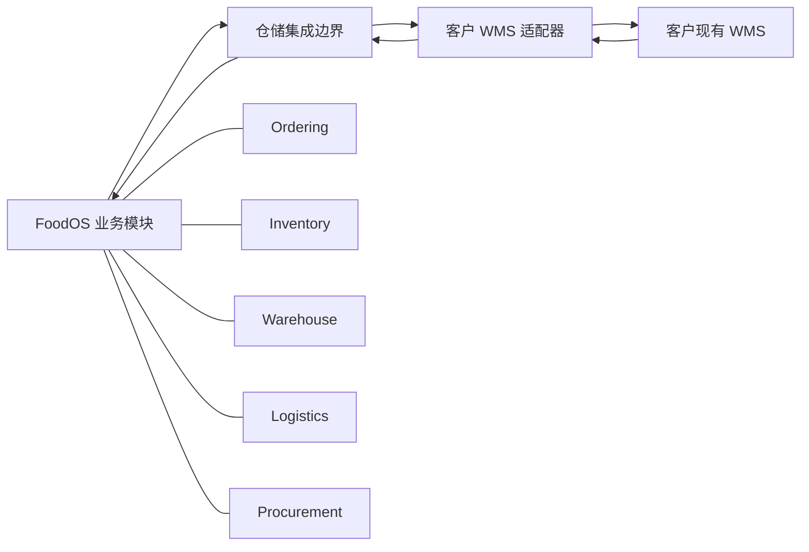
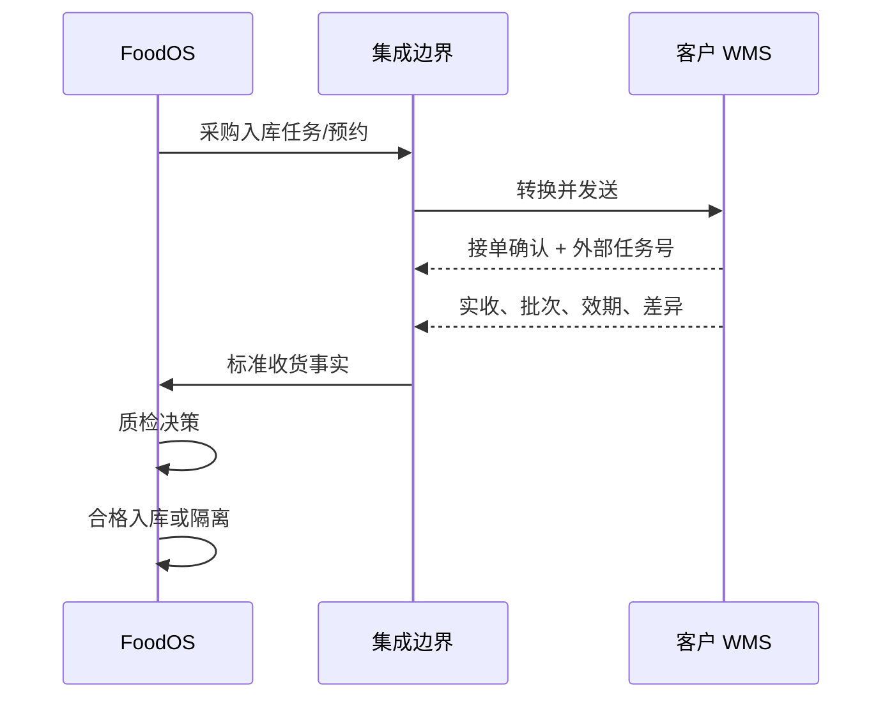
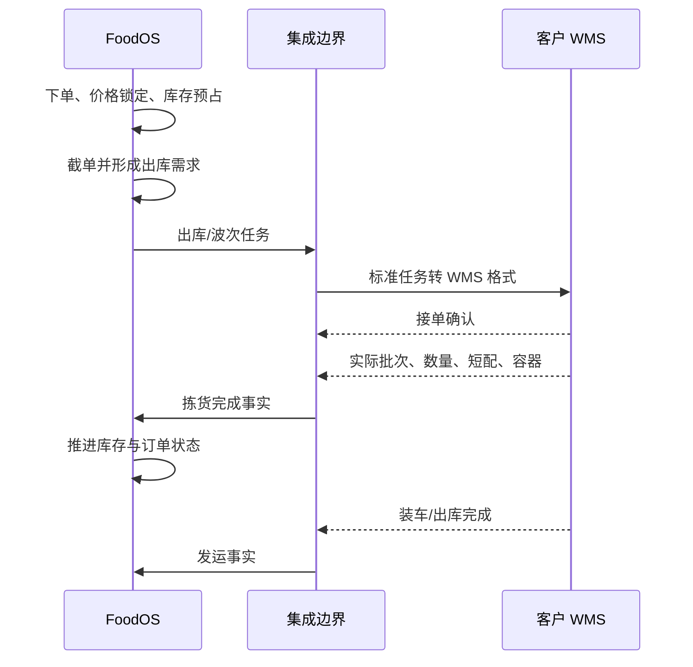

# FoodOS 与客户现有 WMS 对接：技术方案

> 文档用途：双方技术评审的方案基线。
>
> 状态：待确认。本文不代表最终接口承诺；协议、字段、状态和时效需在联合设计阶段冻结。

## 1. 推荐方案

推荐采用“FoodOS 负责业务与运营账、客户 WMS 负责物理仓内执行”的协同模式。



客户 WMS 的协议差异只存在于适配器中。FoodOS 核心模块只接收统一的标准命令和事件，不包含某个 WMS 厂商的字段、状态或鉴权逻辑。

## 2. 责任边界建议

### 2.1 FoodOS 保持权威的数据

- 饭店、门店和用户权限。
- 商品销售状态与价格。
- 销售订单和订单行。
- 客户售后和对账状态。
- 运营库存账和库存流水。
- 采购订单与最终质检决策。
- 客户可见的交付状态。

### 2.2 客户 WMS 保持权威的数据

- 实际库位结构和设备信息。
- PDA 扫描和操作日志。
- 仓内任务实际执行人、时间和设备。
- 实际收货、上架、拣货、复核和装车结果。
- 客户 WMS 自己的任务号、波次号和容器号。

### 2.3 必须共同确认的数据

- 实际批次与效期。
- 可用库存口径。
- 预占和释放。
- 波次生成。
- FEFO 分配。
- 短配与替代品。
- 发运与签收。
- 盘点差异和库存调整。

在这些问题没有确认前，不应直接开发正式写入接口。

## 3. 建议的集成边界

建议设置独立的仓储集成能力，负责：

- WMS 连接配置。
- API、Webhook、消息、SFTP/CSV 或 EDI 适配。
- 外部 ID 映射。
- 原始报文落地。
- 数据标准化和单位转换。
- 入站 Inbox 幂等。
- 出站 Outbox、重试和死信。
- 同步游标和增量拉取。
- 对账及人工重放。
- 同步指标和告警。

该边界不拥有商品、订单或库存的业务主数据，也不直接写其他模块的数据表。所有业务落账必须调用对应模块 Contracts。

## 4. 外部 ID 映射

双方系统的内部 ID 不应相互替代。建议维护以下映射信息：

- Provider/系统标识。
- Connection/连接标识。
- EntityType/对象类型。
- FoodOS InternalId。
- WMS ExternalId。
- WMS ExternalCode。
- 外部版本号。
- 首次和最后同步时间。
- 启用状态。

唯一性建议使用：

```text
Provider + Connection + EntityType + ExternalId
```

首批需要建立的映射：

- Warehouse。
- Zone。
- Location。
- Product/SKU。
- UOM/包装单位。
- Lot。
- PurchaseOrder/InboundOrder。
- SalesOrder/OutboundOrder。
- Wave。
- PickTask。
- Tote/Pallet/SSCC。
- Shipment。
- Store/Consignee。

名称、地址和显示编码只用于核对，不能作为长期唯一键。

## 5. 标准消息信封

无论底层采用 API、消息还是文件，建议统一带以下元数据：

- `messageId`：本次消息唯一 ID。
- `provider`：来源系统。
- `connectionId`：来源连接。
- `eventType`：业务事件类型。
- `schemaVersion`：消息结构版本。
- `externalEventId`：对方事件 ID。
- `externalObjectId`：对方业务对象 ID。
- `externalVersion` 或 `sequence`：对象版本/顺序。
- `occurredAt`：业务发生时间及时区。
- `sentAt`：发送时间。
- `correlationId`：跨系统链路号。
- `causationId`：触发本事件的上游消息号。
- `idempotencyKey`：稳定幂等键。
- `payload`：业务数据。

如果客户 WMS 没有事件 ID 或版本号，需要双方商定可重放的组合键，不能仅依赖接收时间。

## 6. 同步模式

### 6.1 实时事件

适合：

- 任务接收。
- 收货完成。
- 上架完成。
- 拣货完成。
- 短配。
- 装车完成。
- 发运。
- 退货返仓。

优先顺序为消息队列或签名 Webhook；双方只支持 HTTP 时也可使用 REST 回调。

### 6.2 同步请求

适合用户请求中必须立即得到成功/失败的动作，例如：

- WMS 作为预占权威时的库存预占。
- 任务取消是否被接受。
- 对方任务是否成功创建。

同步调用必须有明确超时，超时不能简单认为失败，需要通过查询或幂等重试确认最终结果。

### 6.3 增量拉取

作为事件推送的补偿机制，根据：

- Cursor。
- 更新时间水位。
- 外部对象版本。
- 外部事件序列。

拉取遗漏变化。

### 6.4 全量快照对账

按日或按小时获取：

- SKU/批次库存快照。
- 未完成入库任务。
- 未完成出库任务。
- 当日已拣、已装、已发运任务。
- 异常和取消任务。

快照用于对账和修复遗漏，不直接覆盖 FoodOS 余额。

## 7. 推荐业务交互

### 7.1 商品和主数据

FoodOS 向客户 WMS 提供商品主档或增量变更。双方确认：

- SKU 唯一编码。
- 商品名称和规格。
- 基本单位、包装单位和转换率。
- 温区。
- 保质期和最小剩余效期。
- 是否允许拆零。
- 条码、箱码和托盘码。

客户 WMS 回传外部 SKU ID，FoodOS 建立映射后才允许发送正式任务。

### 7.2 采购入库



如果客户 WMS 承担质检，仍需明确质检结果代码、证据和复核规则，由 FoodOS 映射为合格、隔离或拒收。

### 7.3 销售出库



第一版建议 FoodOS 保持预占和运营库存账，WMS 负责执行；避免一开始就把库存权威切换给 WMS。

### 7.4 取消和改单

需要区分：

- WMS 未接单：FoodOS 可以撤销任务。
- WMS 已接单未拣货：请求取消，等待明确确认。
- WMS 已拣货：不能静默取消，应进入异常/反向作业流程。
- WMS 已发运：不能按取消处理，应走退货或拒收。

FoodOS 只有收到 WMS 的明确取消结果后，才能按双方约定释放相关执行状态。库存预占释放仍由 FoodOS Inventory 规则控制。

## 8. 库存同步策略

### 8.1 动作事件优先

优先接收收货、拣货、出库、退货、盘点等动作，映射到 FoodOS 已有库存动作和流水。

外部事件只能表达事实，不能直接写 `LotBalance`：

- 收货事实 → 质检/入库流程。
- 拣货事实 → Pick。
- 发运事实 → Ship/InTransit。
- 签收事实 → Deliver。
- 返仓事实 → ReturnToWarehouse。
- 盘点差异 → 待审批的 AdjustCount。

### 8.2 快照作为对账数据

外部快照先保存为“WMS 报告库存”，再与 FoodOS 库存账对比。差异应包含：

- 仓库。
- 温区。
- 库位。
- SKU。
- 批次。
- 单位。
- FoodOS 数量。
- WMS 数量。
- 差异数量。
- 最后事件时间。
- 建议原因。

未经审批不得自动调账。

### 8.3 如果客户坚持 WMS 为库存权威

这属于库存权威切换，需要单独方案，至少重新确认：

- Shop 可售量来源。
- 下单预占由谁完成。
- 超时和网络中断时能否下单。
- 订单取消如何释放。
- 批次何时锁定。
- FoodOS 是否只保留影子库存。
- 盘点后如何同步。

在这些问题没有验证前，不建议直接将 FoodOS ATP 替换成 WMS 的一个库存数值字段。

## 9. 幂等、顺序和一致性

### 9.1 幂等

推荐幂等键：

```text
provider + connection + externalEventId
```

如果没有事件 ID：

```text
provider + entityType + externalObjectId + externalVersion
```

同一消息重复到达应返回已处理结果，不重复收货、拣货、发运、退货或调整库存。

### 9.2 乱序

处理前比较外部对象版本或序列号：

- 旧版本：记录并忽略。
- 下一版本：正常处理。
- 跳过中间版本：暂存并触发补拉。
- 与当前 FoodOS 状态冲突：进入人工异常队列。

### 9.3 跨系统一致性

双方不能依赖分布式数据库事务。采用：

- 本地事务。
- Outbox 出站。
- Inbox 去重。
- 至少一次投递。
- 状态查询确认。
- 幂等补偿。
- 周期性对账。

## 10. 入站处理流程

```text
接收消息
→ 验证签名/身份
→ 保存原始报文
→ 幂等检查
→ 校验 schemaVersion
→ 外部 ID 映射
→ 单位、时间、状态标准化
→ 版本与顺序检查
→ 调用业务 Contracts
→ 保存处理结果
→ 返回确认
```

无法映射或无法推进的消息进入异常队列，不能使用名称或“最新一条记录”自动猜测。

## 11. 出站处理流程

```text
FoodOS 业务状态提交
→ 同事务记录 Outbox
→ 后台发送
→ WMS 幂等接收
→ 保存外部任务号
→ 查询或等待异步确认
→ 成功关闭；失败重试
→ 超过阈值进入死信
```

HTTP 超时属于结果未知，不等于对方未执行。重试必须复用同一业务幂等键。

## 12. 安全要求

- 测试、预生产和生产使用不同凭证。
- 优先 OAuth2 Client Credentials、mTLS 或签名请求。
- Webhook 校验时间戳、签名和重放窗口。
- 凭证进入秘密存储，不放数据库明文或代码仓库。
- 连接配置属于运营方 root 范围。
- 最小化同步饭店联系人、地址等敏感信息。
- 原始报文、重放和人工调账都要有审计记录。
- 双方约定 IP、域名、证书更新和密钥轮换流程。

## 13. 可观测性和告警

建议监控：

- 出站待发送数量和最老消息年龄。
- 入站处理延迟。
- 重试和死信数量。
- 外部 API 延迟、超时和错误率。
- 映射缺失数量。
- 库存差异数量和金额。
- WMS 已执行、FoodOS 未推进的任务。
- FoodOS 已下发、WMS 未接单的任务。
- 最后成功同步时间。

告警要能定位 Provider、连接、仓库、对象和 CorrelationId。

## 14. 第一阶段建议范围

第一阶段只做一个仓库、有限 SKU、有限业务日的影子接入：

1. 商品、仓库、温区、库位和单位映射。
2. WMS 库存快照只读同步。
3. FoodOS 与 WMS 库存对账报告。
4. 一种采购收货场景。
5. 一种标准销售出库场景。
6. 重复、乱序、超时和补拉测试。
7. 人工重放和差异处理流程。

在库存对账稳定前，不切换真实订单自动执行。

